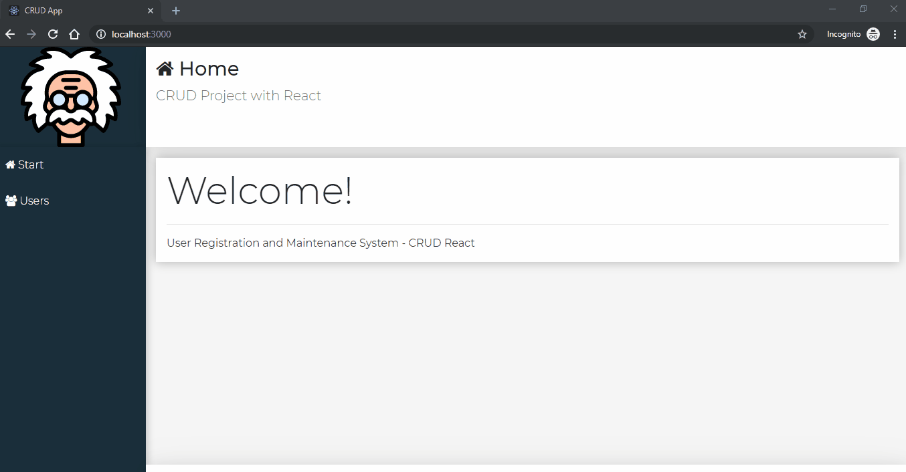

# crud-project
## Javascript CRUD project using React and full fake REST API with Json Server


[](https://github.com/prettier/prettier)
[](https://github.com/rminelli/brastlewark-search/blob/master/LICENSE)

This project was created with:

- Javascript
- React
- Json Server




## How to Use

```bash
# Clone this repository
$ git clone https://github.com/rminelli/crud-project

# Go into the repository
$ cd brastlewark-search

# Backend
$ cd backend

# Install dependencies
$ npm install

# Run backend
$ npm start
Backend runs the with json-server
Resources: http://localhost:3001/users

# Frontend
$ cd frontend

# Install dependencies
$ npm install

#Run backend
$ npm start

Runs the app in the development mode
Open http://localhost:3000 to view it in the browser. (This usually happens automatically)

$ npm test

Launches the test runner in the interactive watch mode
See the section about [running tests](https://facebook.github.io/create-react-app/docs/running-tests)

$ npm run build

Builds the app for production to the `build` folder
It correctly bundles React in production mode and optimizes the build for the best performance.

```

❤️